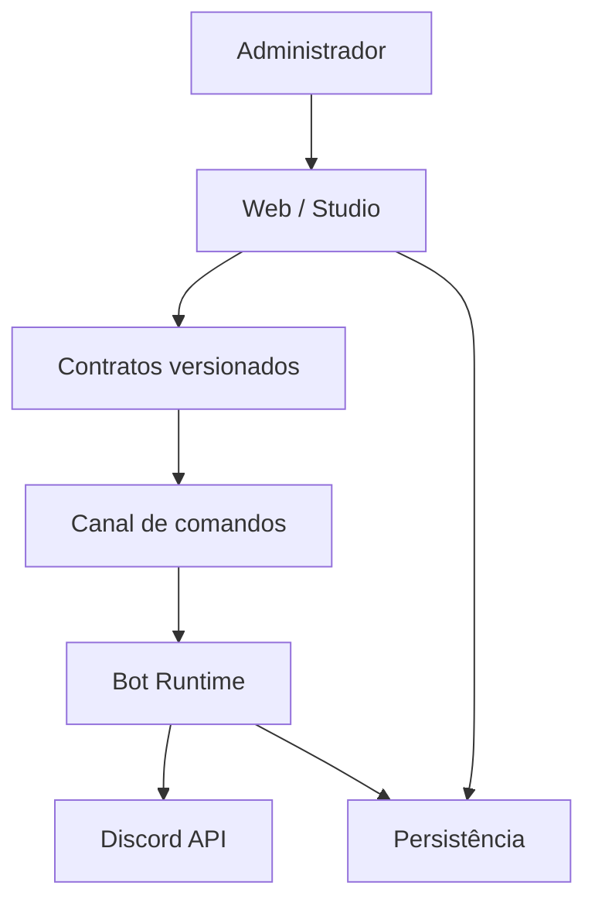

# Visão geral da arquitetura

O diagrama descreve responsabilidades, não uma tecnologia de infraestrutura já escolhida.

## Fluxo de publicação

1. O Studio cria um documento serializável.
2. O Studio Engine valida o grafo e gera um plano de execução.
3. A Web salva uma versão imutável do workflow.
4. A Web solicita publicação por um canal autenticado.
5. O Bot carrega a versão publicada e executa apenas tipos de nó registrados.
6. Eventos e resultados voltam para a trilha de auditoria.

## Limites do domínio

- **Autoria:** edição, preview e versionamento.
- **Publicação:** validação final e ativação por guilda.
- **Execução:** consumo seguro e idempotente pelo Bot.
- **Observabilidade:** logs, métricas, tentativas e falhas.
